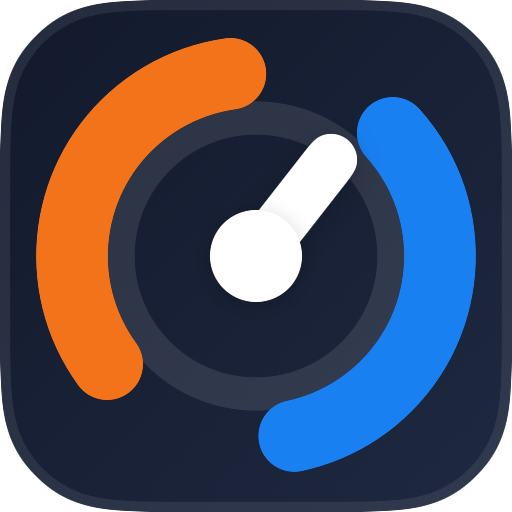
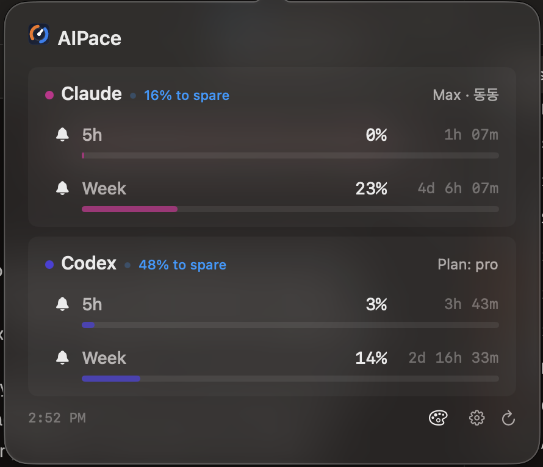
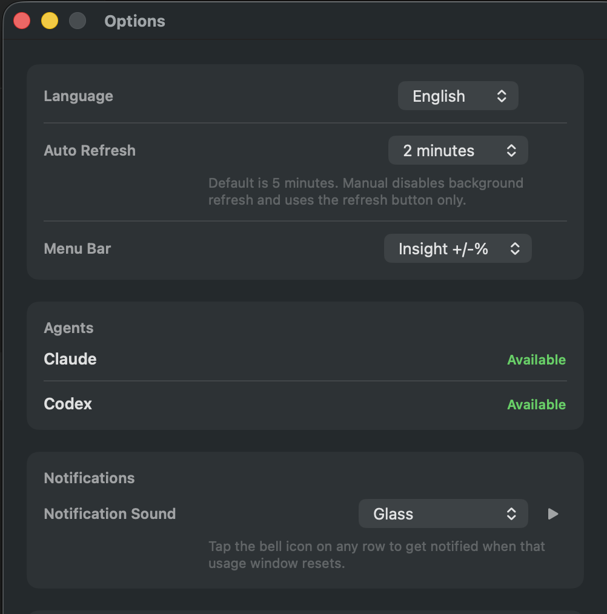
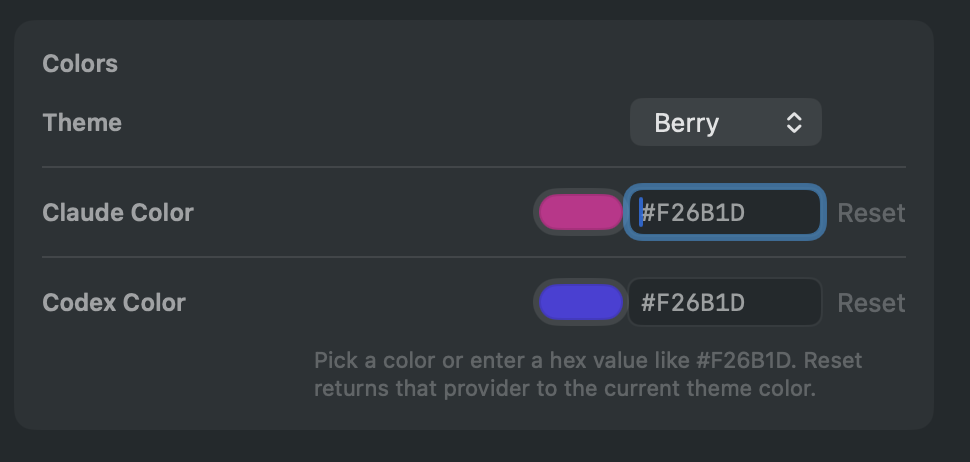

<p align="center">
  
</p>

# AIPace

**A macOS menu bar app that shows your AI usage.**

AIPace is a lightweight menu bar app that shows your current `5h` and `weekly` usage for Claude and Codex on your Mac. It uses your existing CLI login, so there is nothing extra to sign in to.

> This project is unofficial and is not affiliated with, endorsed by, or maintained by Anthropic or OpenAI.

## Features

- 🧪 Menu bar app built with SwiftUI
- 📊 Claude and Codex `5h` and `weekly` usage in one place
- 🔐 Uses your existing local CLI login
- 🔔 Optional notifications when a usage window refreshes
- ⏱️ Refreshes every 5 minutes by default
- 🎨 Custom Claude and Codex colors
- 🧠 Pacing insights for the current usage window

## Screenshots

<p align="center">
  
</p>
<p align="center"><em>Main popover with Claude and Codex usage, pacing, and refresh controls.</em></p>

<p align="center">
  
</p>
<p align="center"><em>Options window for language, refresh timing, notifications, and menu bar display.</em></p>

<p align="center">
  
</p>
<p align="center"><em>Custom color settings for Claude and Codex, with theme-based defaults.</em></p>

<p align="center">
  
  
  
</p>
<p align="center"><em>Menu bar display modes: usage percentages and pacing insight, or both.</em></p>


## What You'll Need

- macOS 14 or later
- Xcode with Swift 6.2 support, or a Swift 6.2 toolchain
- `claude` installed and logged in (for Claude usage)
- `codex` installed and logged in (for Codex usage)

## How It Works

### Claude

AIPace finds your Claude credentials by checking these locations in order:

1. `~/.claude/.credentials.json`
2. macOS Keychain service `Claude Code-credentials`
3. `CLAUDE_CODE_OAUTH_TOKEN` environment variable

Then it calls:

- Usage endpoint: `https://api.anthropic.com/api/oauth/usage`
- Refresh endpoint: `https://platform.claude.com/v1/oauth/token`

It also reads `~/.claude.json -> oauthAccount` for display info only.

**Note:** If macOS asks for Keychain access, that is expected. The app is reading your Claude credentials from Keychain.

### Codex

AIPace uses `codex app-server` with your existing Codex login. It launches from your home directory so you do not get workspace trust prompts.

## Privacy & Security

- **No telemetry**: nothing is tracked
- **No backend**: there is no proxy or app server
- **Local only**: credentials come from your existing CLI auth state
- **Direct connections**: requests go from your Mac to provider endpoints
- **No syncing**: tokens stay on your machine

This app depends on local auth state and provider APIs that can change. If you use it in a security-sensitive environment, review the code first.

## Getting Started

### Option 1: Build A DMG Locally

If you want a DMG, build it yourself from this repo:

```bash
cd /path/to/ai-pace
./scripts/build-dmg.sh
```

This creates a DMG in the `dist/` folder using the current app version from `Info.plist`. Open that DMG and install the app the same way you would other Mac apps: drag `AIPace` into `Applications`.

If you need to override the stamped version for a specific build, pass `--version` explicitly:

```bash
./scripts/build-dmg.sh --version 1.1.0
```

### Option 2: Run From Terminal

```bash
cd app && swift run
```

After launch, look for the Claude and Codex stats in your menu bar.

## Troubleshooting

| Problem | What to try |
|---------|-------------|
| Claude unavailable | Make sure `claude` is installed and logged in, or set `CLAUDE_CODE_OAUTH_TOKEN` |
| Claude Keychain prompt | Expected if your credentials are stored in Keychain — just approve it |
| Codex unavailable | Check that the `codex` CLI is installed, on your `PATH`, and logged in |
| Codex works in Terminal but not from Xcode | Xcode-launched apps often inherit a different `PATH`; AIPace now augments `PATH` with your login shell and common macOS install directories |
| Usage stuck on loading | Try the refresh button, then relaunch the app so it picks up your current shell environment |
| Local build fails | Make sure your Xcode version supports `swift-tools-version: 6.2`, or use a Swift 6.2 toolchain |

## Contributing

Want to help? See [CONTRIBUTING.md](CONTRIBUTING.md).

## Security

To report a security issue, see [SECURITY.md](SECURITY.md).

## Changelog

See [CHANGELOG.md](CHANGELOG.md) for release history.

## License

MIT — see [LICENSE](LICENSE) for details.
